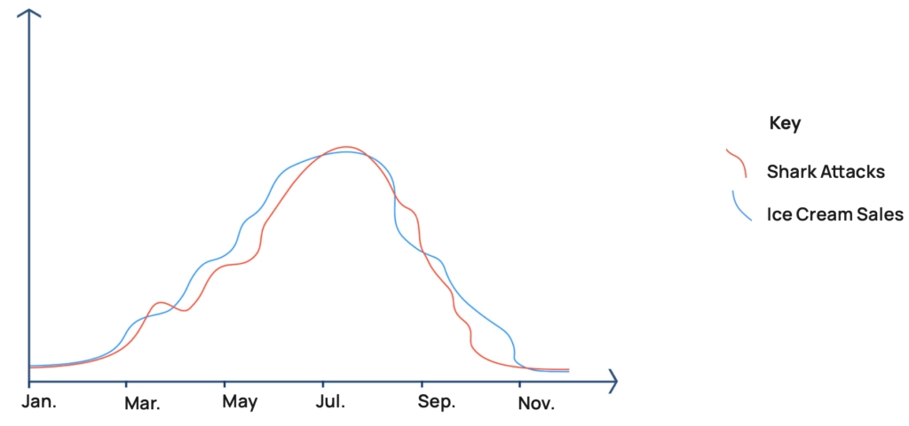
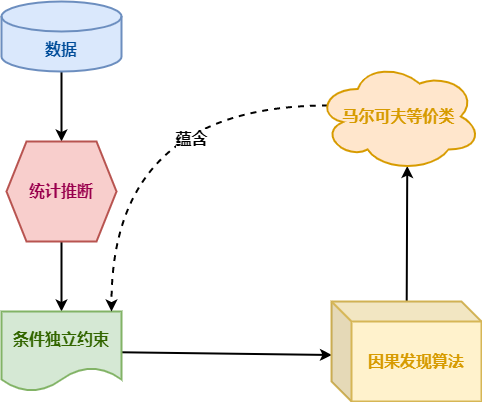
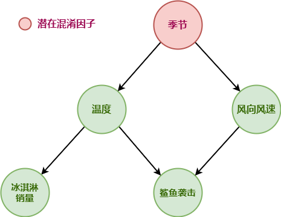

# 因果发现方法概述

## 引言

直到今天，发现因果关系仍然不是一件简单的事情，要么需要进行精心控制的实验，要么依赖人类的原始直觉。
随着技术的不断进步，人工智能可以帮助我们发现因果关系。因果AI能够结合人类直觉和经验，通过观测数据自主发现因果关系。

## 因果知识

系统的因果知识由 *结构化因果模型（SCM）* 来形式化地表示。一个结构化因果模型可以简单地表示为：$\{\mu, \nu, \epsilon\}$，其中 $\mu$ 表示外生变量，$\nu$ 表示内生变量，$\epsilon$ 表示一组描述变量间函数关系的结构方程。结构方程将目标变量$X$ 与其父节点$pa(X)$连系起来。因此结构方程是变量$X$与其父节点$pa(X)$的函数，表述为：$X = f(pa(X), \epsilon)$, 其中$\epsilon$ 是一个噪声变量，反映了这种关系的潜在随机性。

估算结构方程有很多种技术，我们后面会有专门文章具体介绍，本文聚焦在理解系统的因果图结构。从概率的角度讲，结构方程可以反映为所有 $X_i \in \mu \cup \nu$ 之间联合概率的分解：
$$
p(X_1, X_2, \dots, X_n) = \prod_{i=1}^np(X_i \mid pa(X_i))
$$
外生变量和内生变量之间的区别关键在于，外生变量$\mu$的值是由系统的外部机制决定的；而内生变量$\nu$是由系统的内部变量($\mu$或$\nu$)决定的。例如，一个用于预测某美国公司股价的模型，其中股价属于内生变量，但同时股价也受美联储利率影响，美联储利率属于外生变量。

因果AI的指导目标是理解一个系统中感兴趣的变量之间的因果效应。一对变量 $X$ 和 $Y$ 之间的关系可能有如下3种：
$$
\begin{align}
	X \rarr Y  &（X是Y的因）\\
	X \larr Y  &（Y是X的因）\\
	X \larr Z \rarr Y  &（Z是X和Y的共因）
\end{align}
$$
因果AI在区分上面三种情况方面超越了统计机器学习，从而形成了一个更健壮和更灵活的系统模型。没有因果关系就没有相关性，而因果AI通过识别因果结构从而获得对系统更完整的理解。

## 如何获取因果知识

因果知识可以通过三种彼此互补的方式获得：

* 通过整合领域专家的知识和经验
* 通过干预实验
* 通过观测数据进行因果发现

### 领域知识

人类善于识别因果关系。将领域知识转化为结构方程是构建理论模型富有成效的一步。如果人们对某一现象只有部分了解，则可以在不确定性或部分规范下提取领域知识。这种部分的理解仍然可以作为进一步分析的“先验”。

### 干预实验

干预实验是随机对照试验的基础，在新药临床试验和其他科学试验中被广泛采用。相关变量$X$ 和 $Y$有2种可能的因果关系 $X \rarr Y$ 和 $Y \rarr X$ ，其中只有一个是对系统的真实反映，我们需要设计一个实验来确定哪一个。在概率上，这两种场景对应于两种可能的概率表达：
$$
p(X, Y) = p(Y|X)p(X) \\ 
p(X, Y) = p(X|Y)p(Y)
$$
假如我们对变量$X$施加干预，将变量$X$的值固定为$X = x$，那么实际上我们就是对该系统进行了一个控制实验，然后观察干预后概率的变化：
$$
p(Y|do(X=x))p(do(X=x)) = p(Y|do(X=x))\\
p(do(X=x)|Y)p(Y) = p(Y)
$$
这里我们引入了Pearl的**do算子**。注意，基于不同的因果模型，干预do(X=x)得到两种不同的条件概率分布。这些分布可以与实验结果进行比较，以推断出真正的潜在因果结构。这个简单的例子给出了一个一般原则，即关于一个系统的因果结构的信息可以通过对该系统进行明确的干预来获得。在第一种情况下$X \rarr Y$，$Y$的分布随$X$而变化。然后第二种情况$Y \rarr X$， $Y$的分布不变。统计机器学习并不能区分这两种情况。

### 因果发现

不幸的是，在某些情况下干预是不可能的或不道德的，因此我们需要其他工具来单独地从数据中进行因果发现。

我们从最简单的线性回顾举例，线性回归可以定量地评估$X$ 和 $Y$ 之间的关系。我们可以把线性回归看作一个结构方程，其中$X \in \mu$是自变量，$Y \in \nu$是因变量，方程$f \in E$是$y = f(x)$的线性方程。这里的关键问题是，人们必须依赖领域知识或干预实验，才能知晓哪个是自变量哪个是因变量。而因果发现可以从数据中自动提取变量之间的因果方向。广义上讲，因果发现算法可以分为两类：*基于约束的算法* 和 *基于分数的算法*。

#### 基于约束的算法

因果结构蕴含着变量之间的一组独立性关系。也就是说，如果$X$和$Y$没有直接的函数关系或共同的父变量，那么它们就是独立的。基于约束的算法遵循上述逻辑，通过执行一系列统计检验来确定变量之间的依赖关系，然后根据定向规则确定变量之间的因果方向，从而构建起因果图。常见的PC算法和FCI算法都属于这一类。

#### 基于分数的算法

不同于通过本地因果检验的方式构建因果图，基于分数的算法会直接搜索图空间，评估每个图贴合观测数据的程度，从而找到最贴合观测数的图作为最终因果图。最近大火的NOTEARS算法就是基于分数的算法。

## 因果AI如何发现因果

先看一个简单的例子。假设我们有一个数据集，这个数据集包含如下变量：冰激凌销量、鲨鱼袭击次数、温度和风速。

我们假设下列陈述都为真。夏季炎热的气候使得人们购买冰激凌和游泳潜水的次数增加，从而导致鲨鱼袭击事件增多。其他气象现象--比如风--驱使鲨鱼在近海岸活动也会增加鲨鱼袭击。

这些都是因果关系和因果效用。我们可以将其总结为一张因果图（如图1）。因果发现的目的是从数据中找到正确的因果结构，就像下图一样：

图1 上面案例的因果图。温度是冰淇凌销量和鲨鱼袭击的共因。鲨鱼袭击又跟海岸的风向风速有关。

### 关联非因果

从观测数据中发现因果关系很难，因为相关不意味着因果。

例如，鲨鱼袭击和冰淇凌销量有相关性或者说他们在统计上彼此相关（如图2）。但二者之间没有直接的因果关系--是因为维度这个共因导致二者呈现出相关性。这里温度被称为混淆因子。

图2 关联不蕴含因果

如果因果能直接从关联中获取，那么因果发现就变得很容易了，现在的机器学习算法应该早就解决了这个问题。但是正如上面所说的那样，因果发现需要特别的技术去发掘隐藏在关联背后的数据产生过程。

图3 因果关系产生数据中的相关性。因果AI能够发现这些潜在的因果关系，而机器学习只是分析相关性。

### 从数据中找寻因果证据

因果发现算法可以从数据中找到因果关系的线索。其中 **条件独立** 是众多算法找寻的关键证据。下面我们详细拆解一下这个概念。

如果两个变量之间没有任何关系，则说这两个变量独立。独立意味着一个变量的值不会告诉我们关于另一个变量的任何信息。比如特斯拉的股价跟鲨鱼袭击相互独立。

条件独立建立在这面这个概念之上：

> 当给定变量C的值时X和Y彼此独立，那么变量X，Y对给定的变量（或一组变量）C条件独立。

当给定温度后，鲨鱼袭击和冰激凌销量条件独立。因为如果我们已知气温，鲨鱼袭击的发生率不会对冰淇淋销量提供任何新的信息。

为什么条件独立能帮助因果发现？

直觉上，条件独立检验有点类似控制实验。在实验中，我们试图通过控制环境来隔离因果效用，然后调节我们感兴趣的变量。因果发现软件无法做到跟控制实验一样控制环境，但在所有背景因素上进行调节是次优的选择。

### 经典因果发现算法

接下来让我们宏观地看一下因果发现算法，去了解因果发现是如何工作的。

“基于约束”的算法是因果发现算法的一类，它采用条件独立关系作为约束，然后构建能够表示这些约束的因果结构。

图4 基于约束的因果发现算法的流程。首先从数据中建立条件独立关系，然后因果发现算法发现能够表示这些条件独立约束的因果模型。算法最终输出一系列与数据匹配的候选因果结构，称之为“马尔可夫等价类”。

其中"PC算法"是一个经典的基于约束的因果发现算法，

    

        
    

        

            第一步：假设所有变量之间都存在某种关联，我们不知道关联的方向；
        

        

            第二步：进行一系列条件独立检验，找到独立变量，去掉相关的边。然后寻找一个变量对另一个变量的条件独立性，移除边的箭头。重复上述步骤，逐步增加参与条件独立检验的变量。
        

        

            第三步：定向“对撞结构”（形如X1 → Y ← X2的因果结构）。对撞结构在数据中具有独特的特征，因此可以利用它们来确定边的方向。
        

    

图5 PC算法分解

### 应用因果发现的挑战

因果发现算法（例如PC算法）是人工智能在概念上超越传统机器学习的巨大飞跃。但不幸的是，传统算法在实际应用中存在局限性。

#### 假设过强

许多流行的因果发现算法在大多数用例中都会做出过强的假设。例如，PC算法假设数据之外没有混杂因子，这通常是错误的，可能会带来不准确的因果模型。

图6 某些标准算法假设不存在未观测的混杂因子。但现实中往往存在未观测的混杂因子。例如季节（数据中没有）是温度和风速的共因。

#### 计算量大

因果发现算法需要大量计算。例如，随着数据越来越大，PC需要运行的条件独立检验数量会急剧增大。经典的“基于分数”算法是另一种直接搜索可能的因果结构空间的核心方法，但也存在效率低下的问题。这使得大多数因果发现算法在解决实际问题时都显得太慢了。

#### 鲁棒性差

我们研究发现，因果发现算法不能保证有稳定的模型输出。例如我们发现在基于分数的算法上，修改数据的单位会带来完全不同的因果模型输出。这显然不合理，因果模型不应该因为温度数据是用摄氏度表示还是华氏度表示而不同。

#### 选择困难

对于任何给定的应用，都有大量的因果发现算法可供选择。有些算法比其他算法更适合某些用例。如何选择正确的算法需要大量专业知识和经验。
