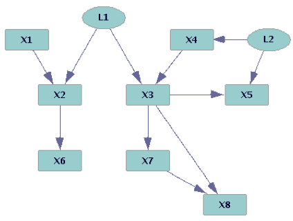
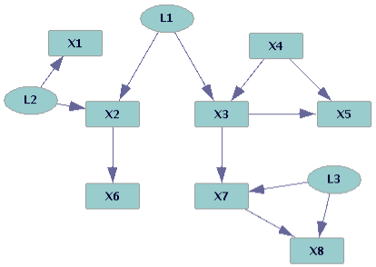
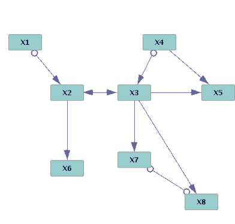

# PAG简介

FCI算法输出的是一个偏祖系图（partial ancestral graph），简称PAG。
PAG是一个图对象用于表示一组无法被算法区分的因果贝叶斯网络（CBN）。
假设我们有一组从某个因果贝叶斯网络随机采样生成的案例，在FCI算法的假设下，FCI返回的PAG保证包含生成这些数据的CBN。

图2是PAG的一个具体例子。

PAG中存在4种类型的边：$A \rarr B, A {\circ\!\!\!\rarr} B, A {\circ\!\!-\!\!\circ} B, A \leftrightarrow B$。
下表给出了这4种边在PAG中的含义：

| 类型 | 描述的关系 | 省略的关系 |
| --- | -------- | -------- |
| $A \rarr B$ | A是B的因。可能是直接原因也可能是包含其他可观测变量的间接原因。同时AB之间也可能存在不可观测的混杂因子| B不是A的因 |
| $A \leftrightarrow B$ | 存在不可观测变量（L）是A和B的共因。从L到A或从L到B的因果路径上可能存在可观测变量。| A不是B的因，B也不是A的因 |
| $A {\circ\!\!\!\rarr} B$ | A是B的因，或存在不可观测变量是A和B的共因，或二者皆有 | B不是A的因 |
| $A {\circ\!\!-\!\!\circ} B$ | 下面情况中的一种： (a) A是B的因 (b) B是A的因 (c) 存在不可观测变量是A和B的共因 (d) a和c (e) b和c| |

图1. 两个FCI（FCI+, GFCI, RFCI）算法无法区分的因果贝叶斯图

图2. 用PAG表示图1的两个因果贝叶斯图
